 

  

## Hello, I’m Ahmed

I’m a software developer from **Multan, Pakistan**, working with **Air University**. I enjoy transforming ideas into practical, user-focused software with clean interfaces and dependable functionality.

My approach is simple: stay curious, build with purpose, and keep improving every day.

## A Little More About Me

<table>
  <tr>
    <td><strong>Currently focused on</strong></td>
    <td>Building useful software and growing as a full-stack developer.</td>
  </tr>
  <tr>
    <td><strong>Based in</strong></td>
    <td>Multan, Pakistan</td>
  </tr>
  <tr>
    <td><strong>Open to</strong></td>
    <td>Meaningful collaborations, creative ideas, and challenging projects.</td>
  </tr>
</table>

## My Digital Space

  

  

### Let’s Connect

&nbsp;&nbsp;

&nbsp;&nbsp;

 

  

<strong>Building useful software, one idea at a time.</strong>

